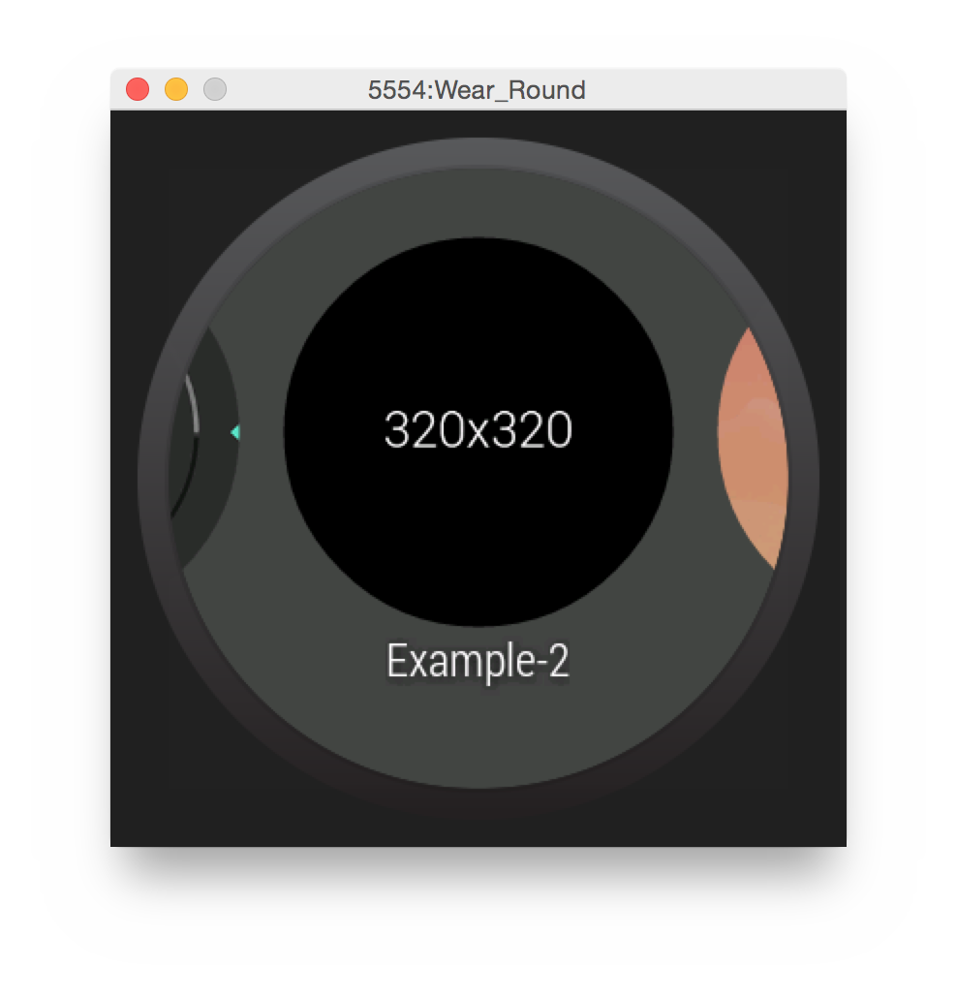

__NOTE: this may or may not work on an emulator that is not HW-accelerated.__
===

Custom watch-faces for Android Wear
===
Notes
----

**This project is just a very bare-bones example of a custom watchface running on Android wear.** I have not tested this on a device, only in the emulator. This should be enough to get you off the ground for now, I will be updating in the future with more examples hopefully.

&bull; This is not perfect.  
&bull; This is completely un-official.  
&bull; I am not responsible for any damage this may cause to your device.  

What do you have to do?
---

To get an Android Activity running as a watch-face is VERY simple. Simply add some extra meta-data as well as intents to your Manifest.

The Activity Tag
---
This is simple enough, in the activity tag you just need to make sure you add

    android:allowEmbedded="true" 

This allows the main "launcher" to embed your activity as a background.

The meta-data
---
    <meta-data android:name="com.google.android.clockwork.home.preview" android:resource="@drawable/preview" />

The resource points to a drawable that is the preview image for your watch-face. This image should be 320x320px or 120x120dp.   
  
Add this inside your activity tag. [Example Here](https://github.com/fodawim/AndroidWearWatchface/blob/master/app/src/main/AndroidManifest.xml)

The Intent Flags
---

    <intent-filter>
        <action android:name="android.intent.action.MAIN" />
        <category android:name="com.google.android.clockwork.home.category.HOME_BACKGROUND" />
    </intent-filter>
    
These allow the system to know that your application will be capable of displaying an activity as a background. Simply add that code snippet inside of your Activity tag and the system will know. [Example Here](https://github.com/fodawim/AndroidWearWatchface/blob/master/app/src/main/AndroidManifest.xml)